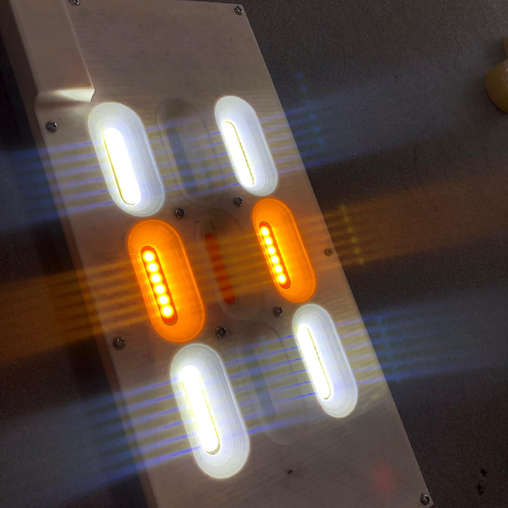
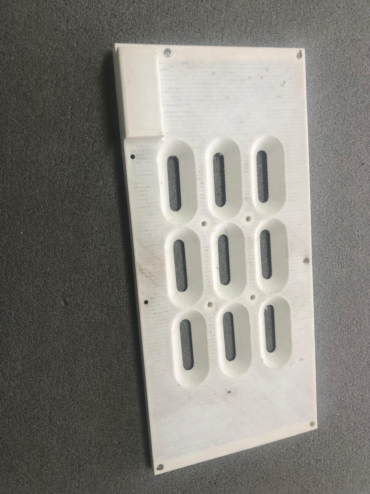
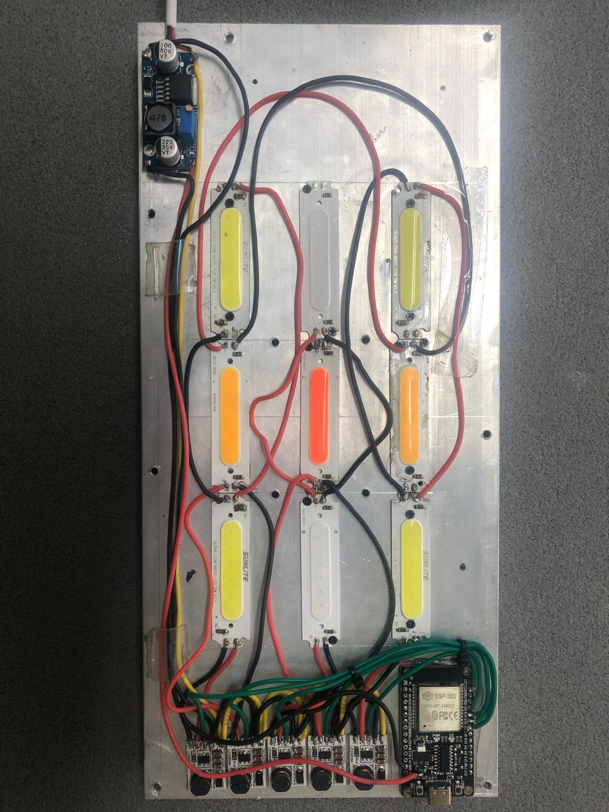

# 🌿 Paladario Automatizado con Home Assistant

Proyecto de paladario (terrario de plantas sin animales) con sistema de iluminación LED controlado mediante ESP32D e integrado con Home Assistant para automatización completa.


## 📋 Descripción

Este repositorio documenta todo el proceso de construcción de un paladario automatizado, incluyendo:
- Sistema de iluminación LED multicolor con control PWM individual
- Control mediante ESP32D programada con ayuda de Copilot
- Integración completa con Home Assistant
- Simulación de ciclos de luz natural (amanecer/atardecer)

## 🔧 Materiales

| Componente | Cantidad | Descripción | Enlace |
|------------|----------|-------------|--------|
| **LEDs 2W** | 9 | 4 blancos, 2 naranjas, 2 azules, 1 rojo | [AliExpress](https://es.aliexpress.com/item/32870970542.html) |
| **Controlador LD3080SA** | 9 | Módulo PWM para control individual de cada LED | [AliExpress](https://es.aliexpress.com/item/1005005975993247.html) |
| **ESP32D** | 1 | Microcontrolador con WiFi para control y conectividad | [AliExpress](https://es.aliexpress.com/item/1005007051270940.html) |
| **Convertidor de Voltaje** | 1 | Step-down para alimentar la ESP32D | [AliExpress](https://es.aliexpress.com/item/1005002772498639.html) |
| **Disipador/Radiador** | 1 | Aluminio para montaje y refrigeración de LEDs | [AliExpress](https://es.aliexpress.com/item/1005007160816023.html) |
| **Fuente de Alimentación** | 1 | 12V/24V según especificaciones de LEDs | - |

## 🎨 Sistema de Iluminación

### Configuración de LEDs
- **4x LED Blanco (2W)**: Luz principal diurna
- **2x LED Naranja (2W)**: Tonos cálidos para amanecer/atardecer
- **2x LED Azul (2W)**: Luz lunar y complemento espectral
- **1x LED Rojo (2W)**: Fotosíntesis y efectos especiales

### Control PWM Individual
Cada LED está conectado a un módulo controlador LD3080SA que permite:
- Atenuación suave (dimming)
- Control de intensidad 0-100%
- Simulación de luz natural
- Efectos personalizados

## 🏗️ Estructura del Repositorio

```
Paladarium/
├── README.md
├── LICENSE
├── .gitignore
├── hardware/
│   ├── README.md
│   └── [Archivos STL y esquemas]
├── code/
│   ├── README.md
│   ├── platformio.ini
│   └── [Código ESP32D]
├── docs/
│   ├── README.md
│   ├── instalacion.md
│   └── home_assistant_config.yaml
└── images/
    ├── README.md
    └── [Fotos del proyecto]
```

## 🚀 Inicio Rápido

1. **Clonar el repositorio**
   ```bash
   git clone https://github.com/Dsate11/Paladarium.git
   cd Paladarium
   ```

2. **Montaje del hardware**
   - Seguir la guía en `/docs/instalacion.md`
   - Ver esquemas de conexión en `/hardware/`

3. **Programar la ESP32D**
   - Abrir el proyecto en `/code/`
   - Configurar credenciales WiFi
   - Flashear el microcontrolador

4. **Configurar Home Assistant**
   - Importar configuración desde `/docs/home_assistant_config.yaml`
   - Ajustar automatizaciones según necesidades

## 📸 Galería

### Sistema de Iluminación en Funcionamiento

*Vista frontal del panel con LEDs blancos y naranjas activos*

### Estructura del Panel

*Diseño 3D impreso para montaje de LEDs*

### Conexiones Completas

*Cableado completo: ESP32D, controladores LD3080SA y convertidor de voltaje*

## 🔌 Diagrama de Conexión

```
Fuente Alimentación (12V/24V)
    │
    ├──────> Convertidor Voltaje ──> ESP32D (5V)
    │                                    │
    │                                    │ (Señales PWM GPIO)
    │                                    │
    └──────> Módulos LD3080SA (x9) <────┘
                    │
                    └──> LEDs individuales (2W cada uno)
```

## 🏠 Integración con Home Assistant

El sistema se integra completamente con Home Assistant permitiendo:
- ✅ Control manual de cada LED individual
- ✅ Automatizaciones por horario
- ✅ Simulación de ciclos naturales (amanecer/día/atardecer/noche)
- ✅ Modos preconfigurados (nublado, soleado, etc.)
- ✅ Monitoreo de estado en tiempo real
- ✅ Control por voz (Alexa/Google Home)

Ver configuración completa en [`/docs/home_assistant_config.yaml`](docs/home_assistant_config.yaml)

## 📝 Programación

La ESP32D fue programada con ayuda de **GitHub Copilot** en Visual Studio Code, especificando:
- Pines GPIO conectados a cada controlador LD3080SA
- Configuración PWM para control de intensidad
- Conexión WiFi para integración con Home Assistant
- Protocolo MQTT para comunicación

## 🎯 Características Futuras

- [ ] Sensores de temperatura y humedad
- [ ] Sistema de riego automatizado
- [ ] Control de ventilación
- [ ] Cámara para monitoreo remoto
- [ ] Registro de datos y estadísticas
- [ ] App móvil personalizada

## 🤝 Contribuciones

Las contribuciones son bienvenidas. Si tienes ideas para mejorar el proyecto:
1. Fork el repositorio
2. Crea una rama para tu feature (`git checkout -b feature/AmazingFeature`)
3. Commit tus cambios (`git commit -m 'Add some AmazingFeature'`)
4. Push a la rama (`git push origin feature/AmazingFeature`)
5. Abre un Pull Request

## 📄 Licencia

Este proyecto está bajo la Licencia MIT. Ver archivo `LICENSE` para más detalles.

## 👤 Autor

**Dsate11**
- GitHub: [@Dsate11](https://github.com/Dsate11)

## 🙏 Agradecimientos

- GitHub Copilot por asistencia en la programación
- Comunidad de Home Assistant
- Comunidad maker y de paladarios

---

⭐ Si este proyecto te resulta útil, considera darle una estrella en GitHub
